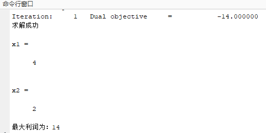
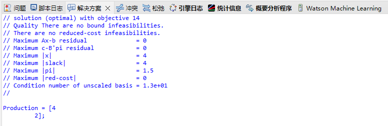
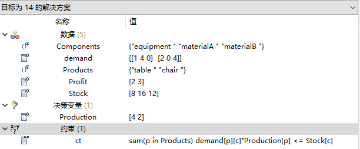
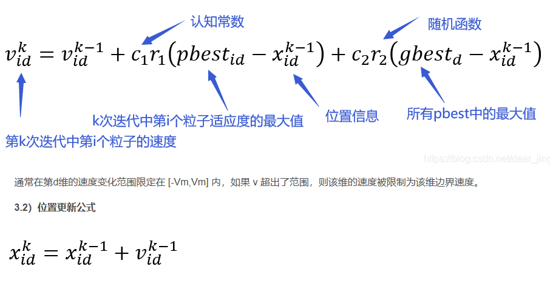
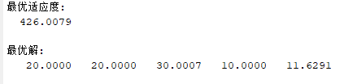

线性/非线性规划问题，Matlab+Yalmip+Cplex，Ilog/Cplex，从入门开始....<br>
==
<br>

欢迎大家批评指正，又cai又爱玩  
<br>
问题一
--
1.某工厂在计划期内要安排生产桌子（table)、椅子（chair），已知生产单位产品所需的设备台时及A，B两种原材料的消耗量，如表所示。该工厂每生产一张桌子获利2元，每生产一件椅子获利3元，问如何安排生产获利最大？
<br>
<br>
<div align="center">
    
|    | 资源约束表 |    |   |
| ------------- | ------------- | ------------- | ------------- |
| Content Cell  | 桌子/张  | 椅子/张  | 合计  |
| 设备台时  | 1  | 2  | 8  |
| 原材料A  | 4  | 0  | 16 kg |
| 原材料B  | 0  | 4  | 12kg  |

</div>
<br>
建议自己写出他的数学模型，非常简单...
<br>
目标函数为：

$$
\text{max } z = 2x_1 + 3x_2
$$

<br>
Subject to:

$$
x_1 + 2x_2 \leq 8
$$
$$
4x_1 \leq 16
$$
$$
4x_2 \leq 12
$$
$$
x_1, x_2 \geq 0
$$

<br>
很简单啊，不解释，下面给出Matlab+Yalmip+Cplex代码，见库中名为Cplex1.m的文件
<br>

```matlab
clc
x = sdpvar(1,2);                    %定义x1，x2
Constraints = [x(1) + 2*x(2) <= 8 , 4*x(1) <= 16,4*x(2)<=12 , x(1)>=0 , x(2) >= 0];   %约束条件

z = 2*x(1) + 3*x(2);         %目标函数

sol = optimize(Constraints , -z);
if sol.problem == 0
    disp('求解成功')
    x1 = value(x(1))
    x2 = value(x(2))
    disp(['目标函数最大值为：' , num2str(value(z))])
else
    disp('求解失败')
    disp(sol.info)
end
```
运行结果如下所示：<br>


<br>
下面给出Ilog/Cplex代码，其文件见库中的Cplex1文件夹。<br>
如下为mod文件代码

```cpp
{string} Products = ...;
{string} Components = ...;

float demand[Products][Components] = ...;
float Profit[Products] = ...;
float Stock[Components] = ...;
dvar float+ Production[Products];

maximize
  sum( p in Products ) 
    Profit[p] * Production[p];
    
subject to {
  forall( c in Components )
    ct:
      sum( p in Products ) 
        demand[p,c] * Production[p] <= Stock[c];
};
```
<br>
如下为dat文件代码

```cpp
Products={ "table " "chair "};
Components={ "equipment ""materialA ""materialB "};
demand=[[1,4,0],[2,0,4]];
Profit=[2,3];
Stock=[8,16,12];
```
<br>
运行结果如下所示：<br>

<div align="center">
  
</div>

<br>

<div align="center">
  
</div>

<br>


至此，第一题完毕--2024.10.18

<br>

问题二，非线性规划问题（POS算法）
--
已知昆明机场次日某时段的航班计划如表所示，设对于连续落地的航班，在次日预报的气象条件下的预计容量为每10min 可以落地 2 架飞机。各机型的地面延误成本为 \( B747 = 130t \), \( B767 = 65t \), \( B737 = 30t \), \( Y7 = 12t \)（单位：元，t 的单位为 min）。求修改后的航班起飞时间表，使地面等待总成本最低。
<br>
<br>
<br>

<div align="center">
    
| 航班号 | 机型  | 起飞机场 | 起飞时刻 | 计划降落时刻 |
|--------|-------|----------|----------|--------------|
| SC981  | B737  | 南昌     | 08:00    | 10:15        |
| CZ3422 | B737  | 成都     | 08:55    | 10:16        |
| MU5407 | Y7    | 贵阳     | 09:20    | 10:17        |
| MF8726 | B767  | 长沙     | 08:30    | 10:17        |
| CA342  | B747  | 武汉     | 08:20    | 10:17        |

<div>
    
<br>
<br>
<div align="left">
解：设航班 `SC981`、`CZ3422`、`MU5407`、`MF8726`、`CA342` 分别编号 `1, 2, 3, 4, 5`，它们计划降落时间分别为 ti ，\( i = 1, 2, 3, 4, 5 \)，即表的第5列给出计划降落的时间。在地面等待每分钟的成本是 Ci ，\(i= 1, 2, 3, 4, 5 \)，也即\[C1 = C2 = 30, C3 = 12, C4 = 65, C5 = 130.\]以每 10 分钟为一个时间段，即时间段 \( j = 1 \) 是 `10:00 ～ 10:10`，\( j = 2 \) 是 `10:10 ～ 10:20`。如果实际降落时间为 Tj ，\( j = 1, 2, ..., 6 \)，那么航班 \( i \) 在时间片 \( j \) 降落的成本是<br>


$$
\[
G_{ij} = c_i \cdot (T_j - t_i^a).
\]
$$
   
目标函数：

$$
\min \sum_{i=1}^{5} \sum_{j=1}^{6} G_{ij} X_{ij} = \min 30x_1 + 30x_2 + 12x_3 + 65x_4 + 130x_5
$$

<br>

约束条件为：
<br>

$$
\sum_{i=1}^{5} X_{ij} \leq 2, \quad \forall j \in \{1,2,\ldots,6\} \quad (\text{每个时间片的容量为 2 架})
$$

$$
\sum_{j=1}^{6} X_{ij} = 1, \quad \forall i \in \{1,2,3,4,5\} \quad (\text{保证每架飞机都有一个落地时间})
$$

$$
X_{ij} = 
\begin{cases} 
1, & \text{第 i 架飞机在时间片 j 可以降落} \\ 
0, & \text{其他} 
\end{cases}
$$

$$
x_i = \sum_{j=1}^{6} (T_j - t_i^a) X_{ij}, \quad i = 1,2,\ldots,5 \quad (\text{等待时间})
$$

<br>
以下为书中给的答案：

调整后的航班时刻表如表所示，总增加成本为`120 + 156 + 150 = 426`。

| 航班号 | 机型  | 地面等待成本 | 原起飞时刻 | 增加地面等待时间 | 原预计降落时间 | 修改后预计降落时间 |
|--------|-------|--------------|------------|------------------|----------------|--------------------|
| SC981  | B737  | 30t         | 08:00      | 5                | 10:15         | 10:20             |
| CZ3422 | B737  | 30t         | 08:55      | 4                | 10:16         | 10:20             |
| MU5407 | Y7    | 12t         | 09:20      | 13               | 10:17         | 10:30             |
| MF8726 | B767  | 65t         | 08:30      | 0                | 10:17         | 10:17             |
<br>

<br>
解答：
-
<br>
这是一个非线性规划求最小值问题，Cplex仅限于线性规划，可以考虑使用POS即粒子算法求解。
<br>
粒子算法原理如图所示：
<br>



<br>
<br>
<br>
直接给出Matlab代码，如下所示
<br>

```matlab
% PSO参数
C1 = 2;               % 加速系数
C2 = 2;
PopG = 100;           % 迭代次数
PopSize = 100;        % 种群规模
D = 5;                % 维度，对应5个航班
Popmax = 60;          % 种群最大值（对应最后一个时间片）
Popmin = 10;          % 种群最小值（对应第一个时间片）
Vmax = 0.15 * Popmax; % 速度上限
Vmin = -Vmax;         % 速度下限
Wini = 0.9;           % 惯性因子初始值
Wend = 0.4;           % 惯性因子终止值

% 等待成本系数
costCoeffs = [30, 30, 12, 65, 130];
% 航班计划降落时间
schedule_time = [15, 16, 17, 17, 17];

% 初始化粒子群
Pop = Popmin + (Popmax - Popmin) * rand(PopSize, D); % 初始位置
V = Vmin + (Vmax - Vmin) * rand(PopSize, D);         % 初始速度
fitness = zeros(PopSize, 1);

% 计算初始适应度值
for j = 1:PopSize
    fitness(j) = Objective(Pop(j, :), costCoeffs, schedule_time);
end

[Bestfitness, Bestindex] = min(fitness); % 第一代种群最佳适应度
PBest = Pop;                             % 个体历史最佳位置
GBest = Pop(Bestindex, :);               % 全局历史最佳位置
fitnesspbest = fitness;                  % 个体历史最佳适应度
fitnessgbest = Bestfitness;              % 全局历史最佳适应度

% 迭代更新
for i = 1:PopG
    for j = 1:PopSize
        % 更新速度和位置
        W = (Wini - Wend) * (PopG - i) / PopG + Wend;
        V(j, :) = W * V(j, :) + C1 * rand * (PBest(j, :) - Pop(j, :)) + C2 * rand * (GBest - Pop(j, :));

        % 速度越界处理
        V(j, V(j, :) > Vmax) = Vmax;
        V(j, V(j, :) < Vmin) = Vmin;

        % 位置更新
        Pop(j, :) = Pop(j, :) + V(j, :);

        % 位置越界处理
        Pop(j, Pop(j, :) > Popmax) = Popmax;
        Pop(j, Pop(j, :) < Popmin) = Popmin;

        % 计算适应度
        fitness(j) = Objective(Pop(j, :), costCoeffs, schedule_time);

        % 更新个体历史最优
        if fitness(j) < fitnesspbest(j)
            PBest(j, :) = Pop(j, :);
            fitnesspbest(j) = fitness(j);
        end
    end

    % 更新全局历史最优
    [currentBestfitness, currentBestindex] = min(fitnesspbest);
    if currentBestfitness < fitnessgbest
        GBest = PBest(currentBestindex, :);
        fitnessgbest = currentBestfitness;
    end

    % 记录历代全局最佳适应度
    result(i) = fitnessgbest;
end

% 输出结果
disp('最优适应度:');
disp(fitnessgbest);
disp('最优解:');
disp(GBest);

% 绘制适应度曲线
figure;
semilogy(result);
grid on;
title('适应度曲线');
xlabel('迭代次数');
ylabel('适应度');

% 目标函数定义
function total_cost = Objective(actual_times, costCoeffs, schedule_time)
    % 初始化总成本
    total_cost = 0;
    % 时间区间划分（每10分钟一个区间）
    time_intervals = 10:10:60;

    % 计算等待成本
    for i = 1:length(actual_times)
        wait_time = max(0, actual_times(i) - schedule_time(i)); % 等待时间为非负
        total_cost = total_cost + costCoeffs(i) * wait_time;
    end

    % 添加容量限制的惩罚
    for j = 1:length(time_intervals) - 1
        % 统计每个10分钟区间内的降落航班数
        flights_in_interval = sum(actual_times >= time_intervals(j) & actual_times < time_intervals(j + 1));
        if flights_in_interval > 2
            % 若超过2架，加入惩罚项
            penalty = (flights_in_interval - 2) * 1000;
            total_cost = total_cost + penalty;
        end
    end
end
```
第二题到此结束，有空我在慢慢解释.../2024.11.07
<br>



<br>


